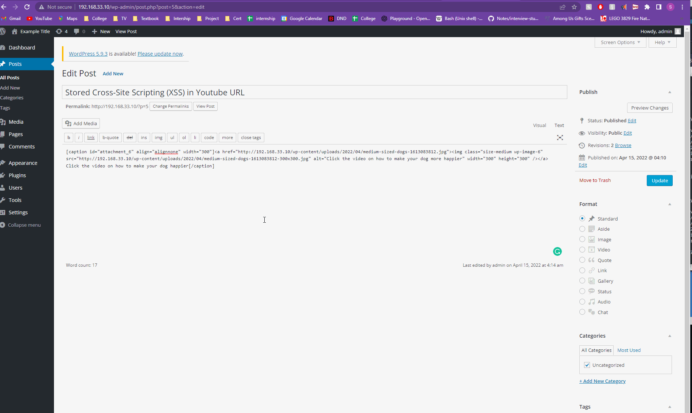
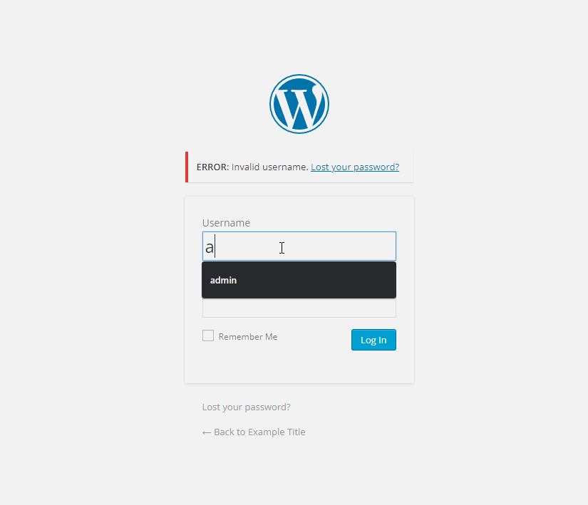
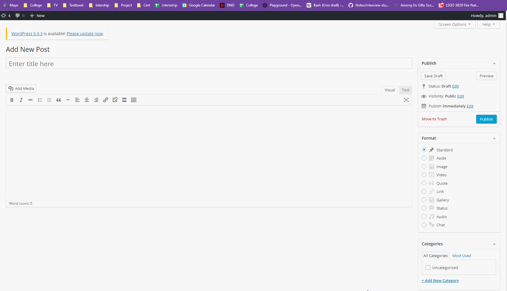

# Codepath-Wordpress-vs-kail
# Project 7 - WordPress Pentesting

Time spent: 10 hours spent in total

> Objective: Find, analyze, recreate, and document **five vulnerabilities** affecting an old version (4.2) of WordPress

## Pentesting Report

### 1. Vulnerability - Stored Cross-Site Scripting (XSS) in YouTube URL
  - [ ] Summary: This vulnerability uses cross-site scripting (XSS) and allows authenticated users to insert malicious JavaScript code in YouTube URL Embeds.
    - Vulnerability types: XSS
    - Tested in version: 4.2
    - Fixed in version: 4.7.3
  - [ ] GIF Walkthrough: 
  - [ ] Steps to recreate: An Admin must approve and publich or update a post with an youtube URL link. The URL link used in the walkthrough was ```[embed src='https://youtube.com/embed/12345\x3csvg onload=alert(1)\x3e'][/embed]```. Everytime the user trys to refresh the page, there will be an alert and a popup will show. 
  - [ ] Affected source code:
    - [Link 1](https://blog.sucuri.net/2017/03/stored-xss-in-wordpress-core.html)
    
### 2.Vulnerability - User Enumeration
  - [ ] Summary: Different messages show up for valid usernames with the wrong password and invalied usernames wiht the wrong password. This can lead to an user enumeration. 
    - Vulnerability types: User Enumeration
    - Tested in version: 4.2
    - Fixed in version: 4.4
  - [ ] GIF Walkthrough:  
  - [ ] Steps to recreate: First type in "admin" for the username and "1234" for the password. Look at the error message that pops up. Then try "user" for the username and "1234" for the password. Look at the different error message that pops up.
  - [ ] Affected source code:
    - [Link 1](https://core.trac.wordpress.org/browser/tags/4.2/src/wp-login.php)
    
### 3. Vulnerability - XSS
  - [ ] Summary: This XSS vulnerability found in preview theme function where one of the callbakcs takes as argument filters out onclick handlers. It is then possible for an attack to create an XSS sxript to inject.
    - Vulnerability types: XSS
    - Tested in version: 4.2
    - Fixed in version: 4.2.4
  - [ ] GIF Walkthrough: 
  - [ ] Steps to recreate: Either create a post or find a post and make a comment in the comments section the following injection ```<a href='/wp-admin/' title="" style="position:absolute;top:0;left:0;width:100%;height:100%;display:block;" onmouseover=alert(document.cookie)//'>Test</a> ```
  - [ ] Affected source code:
    - [Link 1](https://core.trac.wordpress.org/browser/trunk/src/wp-includes/theme.php)

## Assets

List any additional assets, such as scripts or files

## Resources

- [WordPress Source Browser](https://core.trac.wordpress.org/browser/)
- [WordPress Developer Reference](https://developer.wordpress.org/reference/)

GIFs created with [LiceCap](http://www.cockos.com/licecap/).

## Notes

Describe any challenges encountered while doing the work

- I had some issues downloading wordpress and getting it to run on my local machine. It was allowing me to ping in my local machince and visit wordpress in my virtual machine but I was unable to visit the website in my local machine.

## License

    Copyright [2022] [Samantha Mayers]

    Licensed under the Apache License, Version 2.0 (the "License");
    you may not use this file except in compliance with the License.
    You may obtain a copy of the License at

        http://www.apache.org/licenses/LICENSE-2.0

    Unless required by applicable law or agreed to in writing, software
    distributed under the License is distributed on an "AS IS" BASIS,
    WITHOUT WARRANTIES OR CONDITIONS OF ANY KIND, either express or implied.
    See the License for the specific language governing permissions and
    limitations under the License.
